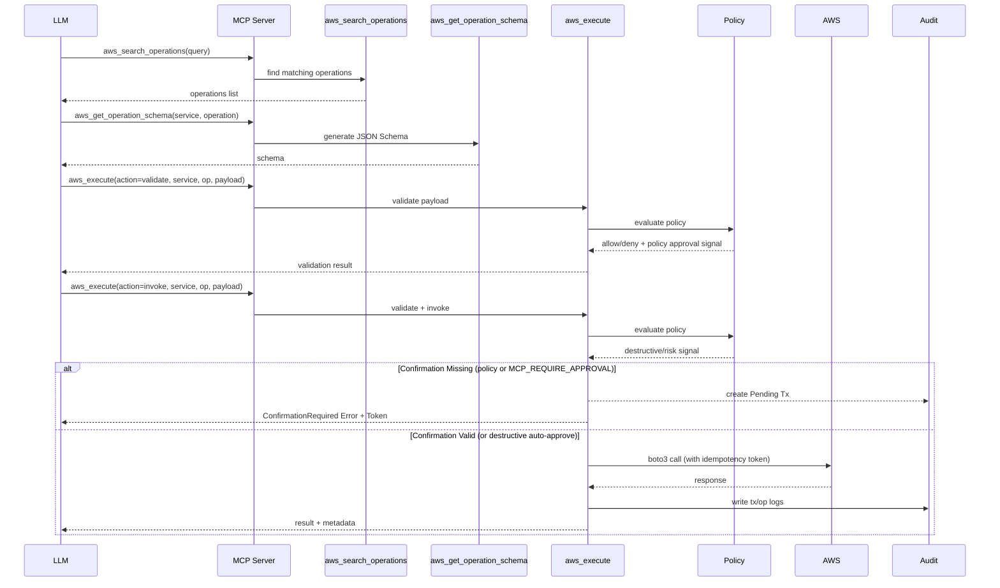
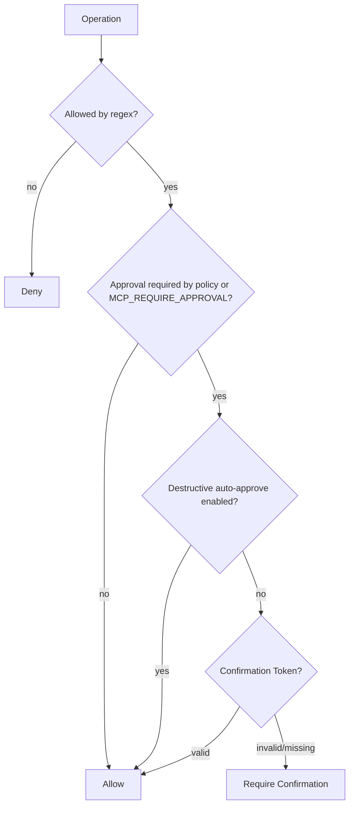
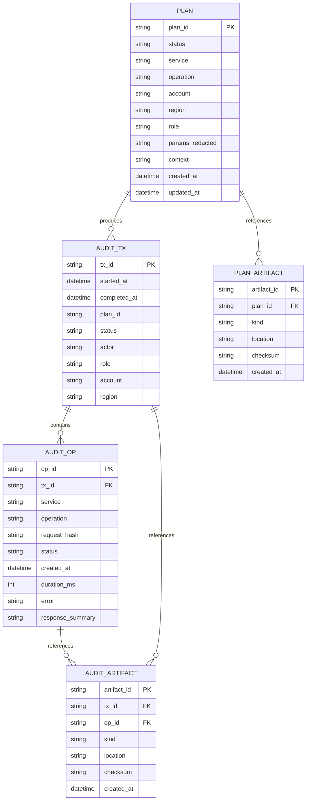

# AWS Tool-Execution MCP Server

## Meta
- **Project Title:** AWS Tool-Execution MCP Server
- **Version:** 3.19
- **Last Updated:** 2026-02-09
- **Document Role:** Architecture / design SSOT
- **History & Versioning:** `/Users/shuto/Projects/mcp_server/aws_cli_v2/HISTORY.md`
- **Rule:** Do not record version history or change log entries in this file.

## Overview

### Purpose & Goals
- Provide a safe, policy-governed MCP server for validating and executing AWS API calls via 3 unified tools.
- Enforce validate-then-invoke workflow with mandatory schema validation before AWS execution.
- Support Smithy-driven tool schemas from AWS-published models with full-service coverage.
- Use local Smithy cache/repository HEAD as the single runtime model source (no per-request model version override).
- Standardize idempotency injection, retries, and persistent audit logging with tx_id/op_id.
- Act as OAuth 2.0 Protected Resource (RFC 9728) for secure remote deployments.
- Keep README as an operator-facing spec/runbook that explains Smithy-first design and auth flow with sequence diagrams.

## Architecture

### File Tree
```
src/aws_cli_mcp/
├── __init__.py
├── app.py
├── server.py
├── config.py
├── logging_utils.py
├── mcp_runtime.py
├── tools/
│   ├── __init__.py
│   ├── aws_unified.py          # 3 unified tools
│   └── base.py
├── auth/
│   ├── __init__.py
│   ├── context.py              # RequestContext, AWSCredentials
│   ├── idp_config.py           # IdP configuration models
│   ├── multi_idp.py            # Multi-IdP JWT validator
│   ├── oauth_proxy.py          # Optional OAuth broker/proxy endpoints
│   ├── protected_resource.py   # RFC 9728 metadata endpoint
│   ├── role_mapper.py          # Claims → Role ARN mapping
│   └── identity_center_middleware.py
├── aws_credentials/
│   ├── __init__.py
│   ├── identity_center.py      # IAM Identity Center provider
│   ├── cache.py                # STS/SSO temporary credential cache
│   └── sts_provider.py         # STS AssumeRoleWithWebIdentity
├── middleware/
│   ├── __init__.py
│   ├── audit.py                # Audit logging middleware
│   └── security.py             # Rate limiting, size limits, timeouts
├── transport/
│   ├── http_server.py          # HTTP/Remote transport
│   └── mcp_handler.py          # MCP JSON-RPC over HTTP handler
├── planning/
│   └── __init__.py
├── execution/
│   ├── __init__.py
│   ├── idempotency.py
│   └── aws_client.py
├── policy/
│   ├── __init__.py
│   ├── engine.py
│   ├── models.py
│   └── loader.py
├── smithy/
│   ├── __init__.py
│   ├── sync.py
│   ├── loader.py
│   ├── parser.py
│   ├── schema_generator.py
│   ├── catalog.py
│   ├── registry.py
│   └── version_manager.py      # Model version management
├── audit/
│   ├── __init__.py
│   ├── db.py
│   ├── models.py
│   └── artifacts.py
├── domain/
│   ├── __init__.py
│   └── operations.py
└── utils/
    ├── __init__.py
    ├── jsonschema.py
    ├── hashing.py
    ├── http.py
    ├── serialization.py
    └── time.py
```

### Tech Stack
- Python 3.11+
- MCP SDK: FastMCP >= 2.11.4
- boto3 >= 1.34 (AWS SDK)
- pydantic >= 2.6
- PyJWT[crypto] >= 2.8 (RSA, EC, EdDSA support)
- starlette >= 0.37
- uvicorn >= 0.29
- SQLite (builtin)
- pytest, pytest-asyncio, pytest-cov, ruff, mypy, pip-audit (dev)

### Pattern
- Clean Architecture with explicit domain models and adapters (MCP layer vs AWS execution).
- 3-Tool Architecture: All AWS operations accessible via unified tools rather than per-operation tools.

---

## Auth & Transport Architecture

### Overview
- **Modules:** `auth/`, `aws_credentials/`, `middleware/`, `transport/http_server.py`
- **Transport modes:** `TRANSPORT_MODE = stdio | http | remote`
- **Auth providers:** `AUTH_PROVIDER = multi-idp | identity-center`
- **Default user policy:** single-user mode (multi-user disabled by default, opt-in via env)
- **Role:** MCP Server acts as **OAuth 2.0 Protected Resource** (RFC 9728), NOT Authorization Server
- **Optional:** OAuth Proxy/Broker mode for strict IdP compatibility (resource/scope translation)

### Architecture Diagram
```
┌─────────────────┐                              ┌─────────────────┐
│  Claude Desktop │                              │  IdP            │
│                 │  1. GET /.well-known/        │  (Entra ID /    │
│  OAuth Client   │     oauth-protected-resource │   Auth0 /       │
│  - PKCE         │◀────────────────────────────│   Google)       │
│  - Token Mgmt   │                              │                 │
│  - Auto-refresh │  2. Authorization Code +     │  Authorization  │
│                 │     PKCE (Browser Auth)      │  Server         │
│                 │─────────────────────────────▶│                 │
│                 │◀─────────────────────────────│                 │
│                 │  3. access_token (JWT)       │                 │
└────────┬────────┘                              └─────────────────┘
         │
         │ 4. MCP Request + Authorization: Bearer <access_token>
         ▼
┌─────────────────────────────────────────────────────────────────┐
│  MCP Server (Protected Resource / Resource Server)              │
│                                                                 │
│  Deployment: direct HTTP or HTTPS behind Ingress/LB/Proxy        │
│                                                                 │
│  Middleware Stack (in order):                                   │
│  1. PreAuthSecurityMiddleware (IP rate limit, size, timeout)    │
│  2. MultiIdPAuthMiddleware (JWT validation → RequestContext)    │
│  3. UserRateLimitMiddleware (per-user rate limit)               │
│  4. AuditMiddleware (request logging with masking)              │
│  5. AWSCredentialMiddleware (role mapping + STS)                │
│  6. MCP Handler                                                 │
│                                                                 │
│  * Single access_token model (JWT format required)              │
│  * No OAuth AS implementation, no refresh_token storage         │
│  * access_token kept in memory only (never logged)              │
└────────────────────┬────────────────────────────────────────────┘
                     │
                     │ 5. STS AssumeRoleWithWebIdentity
                     │    web_identity_token = access_token
                     │    RoleSessionName Required
                     ▼
              ┌─────────────────┐
              │  AWS            │
              │  (Per-request   │
              │   credentials)  │
              └─────────────────┘
```

### Prerequisites
1. IdP access_token **MUST be JWT format** (opaque tokens NOT supported)
2. IdP may output both `aud` and `azp` claims; **azp takes priority** (AWS STS compatibility)
3. `X-Forwarded-*` headers are trusted only when `HTTP_TRUST_FORWARDED_HEADERS=true`

### OAuth 2.0 Protected Resource Metadata (RFC 9728)
- **Canonical Endpoint (for `/mcp` resource):** `GET /.well-known/oauth-protected-resource/mcp`
- **Compatibility Endpoint:** `GET /.well-known/oauth-protected-resource` (same payload for legacy clients)
- **Response:**
```json
{
  "resource": "https://mcp.example.com/mcp",
  "authorization_servers": [
    "https://login.microsoftonline.com/{tenant-id}/v2.0",
    "https://your-tenant.auth0.com/",
    "https://accounts.google.com"
  ],
  "scopes_supported": ["openid", "profile", "email", "aws:execute"],
  "bearer_methods_supported": ["header"]
}
```

### Local Testing Requirement (v2.3)
- `protected_resource.resource` MUST be a single string (list is invalid).
- `protected_resource.resource = "auto"` is supported to derive the runtime resource URL from request host/proto (`.../mcp`).
- `401` challenge should include `resource_metadata` and `scope` for OAuth client discovery stability.
- `WWW-Authenticate.resource_metadata` MUST point to the canonical endpoint for the protected resource (`/.well-known/oauth-protected-resource/mcp` for `/mcp`).
- Scope templates support `{resource}` placeholder and MUST be expanded consistently in:
  - `/.well-known/oauth-protected-resource/mcp`
  - `WWW-Authenticate` challenge header
- Entra + Claude local default should use OIDC scopes only (`openid/profile/offline_access`) and add API scope only when URI alignment is guaranteed.

### OAuth Proxy Mode (v2.8)
- Proxy mode adds local OAuth endpoints while preserving the protected-resource role:
  - `GET /authorize`
  - `POST /token`
  - `POST /register`
  - `GET /oauth/callback`
  - `GET /.well-known/oauth-authorization-server`
  - `GET /.well-known/openid-configuration`
- Proxy mode behavior:
  - Incoming MCP client `resource` parameter is not forwarded upstream by default.
  - Upstream authorization code is exchanged server-side using pre-registered IdP client credentials.
  - Upstream client authentication mode is configurable (`auto` / `client_secret_post` / `none`).
  - Upstream PKCE (`S256`) is always used between proxy and IdP to support public-client policies.
  - Client-facing code/token flow remains RFC 6749 compatible.
  - Tokens are held in memory only for one-time code exchange; no persistent token storage.
- In proxy mode, protected-resource metadata `authorization_servers` points to the proxy origin.

### JWT Validation Requirements
- **Required claims:** `iss` + (`aud` OR `azp`) + `sub` + `exp`
- **Optional claims:** `iat`, `nbf` (validated if present)
- **aud/azp handling:** azp takes priority when present (AWS STS compatibility)
- **Supported key types:** RSA, EC (ES256/ES384/ES512), OKP (EdDSA)
- **Algorithm:** must NOT be "none"; allowed algorithms configurable per IdP
- **Issuer:** must be in allowlist (normalized, trailing slash removed)
- **JWKS:** cached with TTL, failure backoff, kid rotation support
- **Clock skew:** configurable leeway for exp/nbf validation

### Opaque Token Handling
- Detected by checking JWT format (3 dot-separated base64url parts with valid padding)
- Rejected with error code: `opaque_token_not_supported`
- Future extension (out of scope): Token Introspection (RFC 7662)

### Role Mapping
- **Allowlist-only:** claims→Role ARN mappings must be explicitly configured
- **No dynamic Role ARN generation**
- **Matching criteria:** user_id, email, email_domain, groups (optional), custom claims
- **Strategy:** First-match-wins
- **groups claim:** optional (handles missing/huge groups scenarios)

### STS Session Tracking (Mandatory)
- **RoleSessionName:** `mcp-{sanitized_user_id}` (required)
- **SessionTags:** not used in `AssumeRoleWithWebIdentity` (AWS API does not accept `Tags`)
- **Audit linkage:** use `RoleSessionName` + request-scoped audit logs (`request_id`, `issuer`, `user_id`)
- **web_identity_token:** access_token (NOT id_token)

### Identity Center Mode
- Uses `sso:ListAccounts`, `sso:ListAccountRoles`, `sso:GetRoleCredentials`
- **Parallel API calls** for role listing (avoids N+1 problem), concurrency capped at 10 (`asyncio.Semaphore`)
- Pagination safety: all paginated API calls are bounded at 100 pages to prevent infinite loops from malformed responses
- Role selection prompt when multiple roles available
- HTTP/remote stack must apply the same security and audit baseline as multi-idp mode:
  `PreAuthSecurityMiddleware -> IdentityCenterAuthMiddleware -> UserRateLimitMiddleware -> AuditMiddleware -> MCP Handler`

---

## Security Layer

### Middleware Split Architecture
Security middleware is split into **pre-auth** and **post-auth** components to prevent DoS attacks from bypassing protection:

| Middleware | Position | Features |
|------------|----------|----------|
| PreAuthSecurityMiddleware | Before Auth | IP rate limit, body/header size limits, request timeout |
| UserRateLimitMiddleware | After Auth | Per-user rate limit (requires authenticated user_id) |

Forwarded headers (`X-Forwarded-For` / `X-Forwarded-Proto` / `X-Forwarded-Host`) are ignored by default and only used when explicitly enabled (`HTTP_TRUST_FORWARDED_HEADERS=true`).

### Security Features
| Feature | Requirement |
|---------|-------------|
| IP Rate Limiting | Per-IP: configurable (default 1000 req/min) |
| User Rate Limiting | Per-user: configurable (default 100 req/min) |
| Request Body Size | Configurable (default 10MB), **enforced by actual streamed body bytes regardless of Content-Length or chunked encoding** |
| Header Size | Configurable (default 8KB) |
| Request Timeout | Configurable (default 30s) |
| Audit Log | user_id, operation, timestamp (tokens masked) |
| Log Masking | access_token, refresh_token, secret, password, credential, authorization |
| JSON-RPC Batch Limit | Bounded batch size to prevent single-request amplification |

### OAuth Proxy Hardening
- `/authorize` validates redirect URI and rejects malformed or unsafe values early.
- Unregistered clients are restricted to loopback redirect URIs (localhost/127.0.0.1/::1) to avoid open redirect abuse.
- Authorization Code flow requires PKCE (`S256`) and validates challenge/verifier shape.
- `/token` requires `client_id` and `redirect_uri` for authorization_code exchange and binds them to stored authorization code record.
- `/token` refresh_token flow requires registered client binding and enforces `token_endpoint_auth_method` credentials.
- In-memory OAuth stores (`transactions`, `codes`, `clients`) are capacity-limited to reduce memory DoS risk.
- Transaction pop in `callback()` and authorization code consumption in `token()` are atomic operations under `asyncio.Lock` to prevent TOCTOU race conditions.
- `/token` validates `client_id` and `redirect_uri` **before** consuming the authorization code to prevent DoS via code-wasting with wrong client_id.
- Upstream token responses are filtered to standard OAuth fields only (`access_token`, `token_type`, `expires_in`, `refresh_token`, `scope`, `id_token`) to avoid forwarding internal IdP session data.
- Upstream OIDC discovery endpoints (`authorization_endpoint`, `token_endpoint`, `jwks_uri`) are validated to require HTTPS and reject private/link-local IP addresses (SSRF protection).
- Upstream token error details are logged server-side and client response is sanitized.
- STS `AssumeRole` failure details are not exposed to the client; a generic `credential_error` message is returned.

### Chunked Transfer Encoding Protection
- Content-Length header check (fast path)
- Streaming body size check for chunked requests (early termination on limit exceed)
- POST/PUT/PATCH requests are size-checked via streaming read even when Content-Length is present
- Invalid/negative Content-Length must be treated as untrusted and must not bypass stream size enforcement
- Streaming body reads use `bytearray` buffer (not `list[bytes]` + `b"".join()`) to reduce peak memory

### Input Validation & Defense in Depth
- `transport_mode` is validated as `Literal["stdio", "http", "remote"]` at configuration load
- Default bind host is `127.0.0.1` (loopback only); explicit `0.0.0.0` required for network exposure
- CORS middleware is placed outermost in the Starlette middleware stack so OPTIONS preflight requests receive CORS headers before auth middleware can reject them
- Invalid JSON in `options` parameter returns an error response (not a silent fallback to `{}`)
- `_coerce_payload_types` enforces a recursion depth limit (`_MAX_COERCE_DEPTH = 30`) to prevent stack overflow from deeply nested payloads
- `raw_claims` in `RequestContext` is wrapped in `MappingProxyType` for immutability
- Unhandled tool handler exceptions return generic "Internal tool error" to clients; details are logged server-side only (both HTTP and stdio modes)
- `_parse_role_arn` supports `aws`, `aws-cn`, and `aws-us-gov` ARN partitions
- `RoleMappingEntry.role_arn` validated with full regex `^arn:aws(-cn|-us-gov)?:iam::\d{12}:role/[\w+=,.@/-]+$`
- Confirmation token consumption uses atomic SQL `UPDATE … WHERE status='PendingConfirmation'` + rowcount check to prevent TOCTOU double-execution
- Confirmation flow allows stdio mode (both actors `None`) while still enforcing actor match in authenticated HTTP mode
- `service`/`operation`/`query` parameters enforce `maxLength` (128/256) to bound audit log and hash operations
- Catch-all role mappings (no user/group/claim constraints) emit a startup warning
- Smithy `sync_ref` validated against `^[a-zA-Z0-9._/+-]+$`; `sync_url` restricted to HTTPS scheme
- `jwks_uri` discovered via OIDC is validated for HTTPS and non-private IP resolution
- Log values (`request.url.path`, `client_ip`) are sanitized against control characters to prevent log injection
- Identity Center AWS error messages are mapped to generic safe messages (raw details logged server-side only)
- Unsupported method name truncated to 256 characters in error responses
- `ArtifactStore.read_json` validates resolved path is within base directory (path traversal prevention)
- Cache key for boto3 clients uses credential fingerprint hash only (no plaintext access key ID)
- Unknown JWT issuer returns generic `invalid_token` error to prevent issuer enumeration via error code differentiation

### Multi-Worker Constraints
- Rate limiters (`_shared_rate_limiter`) and single-user guard (`_guard`) are process-local singletons.
  With Uvicorn `--workers N` (N > 1), each worker maintains independent counters.
  Deploy with `workers=1` or use an external rate-limit store for strict enforcement.

---

## Diagrams

### Unified Tool Flow (3-tool architecture)


### Policy Evaluation


### Middleware Stack (HTTP/Remote)


---

## Data

### Schema & ER Diagram


---

## Components

### MCP Tools (3 Unified Tools)

- Canonical tool names only: `aws_search_operations`, `aws_get_operation_schema`, `aws_execute`
- Legacy dotted aliases are removed and unsupported.

#### aws_search_operations
Search AWS operations from Smithy models.

**Input:**
```json
{
  "query": "lambda invoke",
  "serviceHint": "lambda",
  "limit": 20
}
```

**Output:**
```json
{
  "count": 5,
  "results": [
    {"service": "lambda", "operation": "Invoke", "summary": "Invokes a Lambda function", "risk": "low"}
  ]
}
```

#### aws_get_operation_schema
Get JSON Schema for an AWS operation.

**Input:**
```json
{
  "service": "lambda",
  "operation": "Invoke"
}
```

**Output:**
```json
{
  "service": "lambda",
  "operation": "Invoke",
  "schema": {...},
  "description": "Invokes a Lambda function"
}
```

#### aws_execute
Validate and invoke AWS operations.

**Input:**
```json
{
  "action": "validate|invoke",
  "service": "lambda",
  "operation": "Invoke",
  "payload": {"FunctionName": "my-function"},
  "region": "us-east-1",
  "options": {
    "dryRun": false,
    "confirmationToken": "...",
    "accountId": "123456789012",
    "roleName": "ReadOnly"
  }
}
```

**Success Output:**
```json
{
  "service": "lambda",
  "operation": "Invoke",
  "result": {...},
  "metadata": {"tx_id": "...", "op_id": "..."}
}
```

**Confirmation Required Output:**
```json
{
  "error": {
    "type": "ConfirmationRequired",
    "message": "Destructive operation requires confirmation.",
    "hint": "...",
    "reasons": ["Token: A1B2C3", "Target: ..."],
    "retryable": true
  }
}
```

**Blob Fields:**
- Binary data must be provided as **base64-encoded strings**
- No local file path support (security: remote server deployment)

### Core Components
| Component | Description |
|-----------|-------------|
| VersionManager | Manages model versions with LRU caching, provides ModelSnapshot access |
| SmithyCatalog | Indexes and searches operations from Smithy models (search returns lazy generator) |
| PolicyEngine | Evaluates allow/deny rules, destructive actions, tag constraints |
| SmithyLoader/Parser | Loads and parses Smithy models from AWS repository |
| SmithySync | Clones/pulls AWS api-models-aws repository, tracks commit SHA |
| SchemaGenerator | Converts Smithy input shapes to JSON Schema |
| Executor | Executes AWS calls with idempotency injection and audit logging |
| AuditStore | SQLite access layer for tx/op logs |
| ArtifactStore | File-based payload storage with DB references |
| MultiIdPValidator | Validates JWT access_tokens from multiple IdPs (RSA/EC/OKP keys) |
| MultiIdPAuthMiddleware | Validates tokens, sets RequestContext with access_token, and stores claims as immutable defensive copies |
| AWSCredentialMiddleware | Role mapping (allowlist) + STS AssumeRoleWithWebIdentity |
| CredentialCache | Single-flight cache for STS credentials |
| RoleMapper | Maps verified access-token claims to role ARNs |
| STSCredentialProvider | UNSIGNED STS client, mandatory RoleSessionName (no SessionTags in WebIdentity) |
| IdentityCenterProvider | IAM Identity Center integration with parallel role fetching |
| PreAuthSecurityMiddleware | IP rate limiting, request size limits, timeouts |
| UserRateLimitMiddleware | Per-user rate limiting (after auth) |
| AuditMiddleware | Request logging with sensitive field masking |
| ProtectedResourceMetadata | Serves /.well-known/oauth-protected-resource and /.well-known/oauth-protected-resource/mcp (canonical for `/mcp`) |

---

## Strategies

### Performance
- Cache parsed Smithy models and generated schemas in-memory with LRU eviction
- Load Smithy schema from local cache/repository HEAD (runtime version override is not exposed)
- Index audit tables on tx_id, op_id, plan_id, and request_hash
- Add composite index on `audit_tx(status, started_at)` to keep pending-token cleanup O(log n)
- Avoid O(n²) ops by using dict/set for operation lookups
- 3-tool architecture eliminates tool explosion (no per-operation tools)
- **Identity Center parallel fetching:** `asyncio.gather` for list_account_roles calls, capped at 10 concurrent requests
- **boto3 client cache:** `OrderedDict`-based LRU with max 256 entries and 1-hour TTL per entry.
  Cache key is (service, region, credential fingerprint) to preserve connection pooling while
  preventing cross-principal client reuse. Expired and LRU-evicted entries are cleaned under lock.
- Policy regex patterns are compiled once at startup and reused for all requests.
- Token Cleanup: Lazy cleanup on execution (tokens > 1 hour old deleted)
- HTTP mode: audit DB/artifact writes run via asyncio.to_thread
- Confirmation token binding: must match original actor/service/operation/payload hash
- **SmithyCatalog.search()** returns a lazy generator (`yield`), allowing consumers to apply policy filters and limits without materializing the full result set in memory.
- **Server initialization** is lazy (`get_server()`); importing `aws_cli_mcp.server` no longer triggers `load_settings()` or `build_server()` at module scope.
- **MCP handler JSON serialization** uses a single `json.dumps(payload, default=json_default)` pass instead of the prior encode→decode→encode round-trip.
- Response size control: streaming body reads and MCP result payload are capped by `MAX_OUTPUT_CHARACTERS`
- Large response handling is adaptive: when payload exceeds `MAX_OUTPUT_CHARACTERS`,
  `aws_execute` returns structured compact output (list caps + long-string truncation +
  operation-aware heavy-field omission) instead of flat string-only preview truncation.
- Adaptive compacting is multi-layered: operation-specific omit rules + cross-service
  generic heavy-field omit rules are applied progressively before falling back to preview.
- Response shaping supports execution options (`responseMode`, `maxResultItems`,
  `omitResponseFields`) so callers can switch between fidelity and readability.
- SQLite concurrency: serialize access with connection-level lock
- Log file bootstrap: when `LOG_FILE` is configured, ensure the parent directory exists
  before opening `FileHandler` to avoid startup log-path failures on fresh environments.
- Logging initialization must run for all transports (`stdio` / `http` / `remote`);
  HTTP/remote entrypoint must not skip `configure_logging()`.
- HTTP/remote runtime must disable Uvicorn default `log_config` and reuse
  `configure_logging()` as the single logging configuration source.

### Security Hardening
- `MCP_REQUIRE_APPROVAL=true` enforces two-phase confirmation for all `invoke` calls,
  independent of destructive/risk classification.
- `AWS_MCP_AUTO_APPROVE_DESTRUCTIVE=true` only bypasses confirmation for policy-derived
  destructive approvals; it must not bypass global `MCP_REQUIRE_APPROVAL`.
- JWT `aud` list parsing must ignore non-string entries and fail closed without throwing internal exceptions.
- Policy regex safety guard rejects unsafe patterns at startup (invalid syntax,
  excessive length, look-behind, backreferences, nested quantifiers) to reduce ReDoS risk.
- Required-tag values are length-capped before regex matching to bound worst-case CPU cost.

### Auth Compatibility
- Validate `protected_resource.resource` type at startup and fail fast on invalid config.
- Prefer `resource="auto"` in local/dev to avoid hardcoded host mismatch during OAuth discovery.
- Return RFC 6750 `WWW-Authenticate` challenge with `resource_metadata` and `scope`.
- Use canonical `resource_metadata` URL `/.well-known/oauth-protected-resource/mcp` for `/mcp` protection (keep root endpoint for compatibility).
- `/mcp` endpoint is POST-only; `GET /mcp` returns 405 by design.
- HTTP app lifecycle hooks use Starlette `lifespan` (not deprecated `on_startup` / `on_shutdown`).
- JSON-RPC notifications (`id` omitted) return 202 by design.
- JSON-RPC request root must be object or batch array; scalar/null roots must return `invalid_request` (no unhandled exception).
- OAuth proxy loopback validation must treat IPv6 loopback consistently (`http://[::1]:<port>/...` accepted as loopback).
- OAuth discovery probes to non-canonical paths (e.g. `/.well-known/openid-configuration/mcp`)
  may return 401 and are non-fatal when canonical discovery endpoints succeed.
- Uvicorn WebSocket stack is disabled (`ws=none`) because this server exposes HTTP MCP endpoints only.
- For `TRANSPORT_MODE=remote` with `AUTH_PROVIDER=multi-idp`, externally visible auth/resource URLs
  must use `MCP_PUBLIC_BASE_URL` / `server.public_base_url` (avoid raw Host-header reflection).
- Operation names provided by callers (case/snake/kebab variants) must be canonicalized to Smithy catalog operation IDs before:
  policy evaluation, boto3 method resolution, audit logging, and response metadata emission.

### Federation Requirements (Entra + AWS STS)
- AWS IAM OIDC Provider URL MUST exactly match token `iss` claim.
- For Entra v2 tokens, issuer is `https://login.microsoftonline.com/<tenant-id>/v2.0`.
- IAM OIDC Provider `client_id_list` MUST include actual token audience values
  (`aud` or `azp` used by AWS STS).
- Role selected in `role_mappings` MUST trust the federated principal and allow
  `sts:AssumeRoleWithWebIdentity`.
- `AWSReservedSSO_*` roles are not suitable default targets for WebIdentity unless
  explicitly configured with matching trust policy.

### Federation Build Procedure (Implemented Pattern)
1. Entra API app:
   - Expose API scope (example: `aws.execute`, this is OAuth scope not MCP tool name)
   - Set `accessTokenAcceptedVersion=2`
2. Entra client app for OAuth proxy upstream:
   - Register redirect URI (`/oauth/callback` on MCP host)
   - Choose public vs confidential client model
3. `idp_config.yaml`:
   - `idps[].issuer` = Entra v2 issuer
   - `idps[].audience` = token `aud`/`azp` values
   - `oauth_proxy.upstream_token_auth_method` matches client model (`none` or `client_secret_post`)
4. AWS IAM:
   - Create IAM OIDC Provider with exact issuer URL
   - Add audience values to `client_id_list`
   - Create dedicated IAM role trust policy for `sts:AssumeRoleWithWebIdentity`
5. App authorization:
   - Point `role_mappings` to dedicated role ARN
   - Verify `/token` success and `/mcp` returns 200 for tool calls

### Testing
- pytest with unit tests for policy engine, validation, and execution
- Goal: 100% line coverage on `src/aws_cli_mcp` in CI/local verification runs
- Current status (2026-02-09): `pytest --cov=src/aws_cli_mcp` reached 100% line coverage.
- `pytest` must run without manual `PYTHONPATH=src`; import path is configured in project test settings.
- Test suite quality target includes zero-warning execution (`pytest` warnings summary must stay empty).
- Strict warning gate validation uses `pytest -W error` to fail on runtime warning leaks (event loop/socket/sqlite cleanup defects).
- SQLite-backed stores must support explicit lifecycle cleanup (`close()`) and tests must release connections via fixture teardown.
- Add tests for protected resource metadata generation (static + auto mode).
- Add tests for auth challenge header shape on missing token.
- Async test execution is standardized with `pytest-asyncio` auto mode; custom `asyncio.run` hooks in test harness are disallowed to prevent event-loop/socket leak warnings.
- Test harness enforces per-test event-loop cleanup (close non-running default loops after each test) to keep `-W error` runs free from unclosed loop/socket unraisable warnings.
- Tests must disable external-network Smithy sync (`SMITHY_AUTO_SYNC=false`) unless a test explicitly validates sync behavior.
- CI quality gates must be strict-by-default for OSS publication:
  - hard gate: `pytest -q -W error --cov=src/aws_cli_mcp --cov-report=term-missing --cov-fail-under=100`
  - hard gate: `ruff check src tests`
  - hard gate: `mypy src/aws_cli_mcp`
  - hard gate: `pip-audit --progress-spinner off`
- CI observability policy:
  - `quality` and `sca` jobs must run even when `test` fails, so static-analysis/security results are never hidden by upstream skips.
- Pytest async policy:
  - `pytest-asyncio` is a required dev dependency because pytest config uses async loop-scope options.
- Optional advisory jobs may exist for experiments, but merge safety must not depend on runtime flags.
- Local SCA verification should run with the project virtualenv binary
  (`.venv/bin/pip-audit --progress-spinner off`) to avoid host PATH drift.
- Local coverage gate should run with
  `pytest --cov=src/aws_cli_mcp --cov-report=term-missing --cov-fail-under=100`.
- Ruff policy:
  - `src/` keeps `E/F/I` enforcement.
  - `tests/` relaxes only `E501` (line length) to reduce noise from long fixture/payload literals.
- Type-check debt reduction policy:
  - Prefer fixing internal type defects in source code over broad `type: ignore`.
  - Third-party libraries without `py.typed` metadata are handled via narrowly-scoped mypy module overrides.
  - Do not use global `ignore_missing_imports`; keep unknown types isolated to adapter boundaries.

### Documentation
- README must explicitly describe supported MCP clients (Claude Code/Claude Desktop/Gemini CLI test support).
- README must explain Smithy model concepts (shape/trait), MCP relevance, and why 3-tool model is used.
- README must not maintain version/change history; it must reference `HISTORY.md` for chronology.
- README must include separate auth flow diagrams for:
  - HTTP/Remote with OAuth (multi-idp/proxy mode)
  - HTTP with pre-issued SSO token (identity-center mode)
  - stdio local mode
- README must document production network security stance: TLS termination at ALB/Nginx/API Gateway in front of MCP server.

### Configuration Source of Truth
- In `AUTH_PROVIDER=multi-idp`, `idp_config.yaml` is the primary auth-policy source (IdP allowlist, role mappings, OAuth proxy).
- Security numeric values (`rate_limit_per_user`, `max_body_size_mb`, etc.) should be sourced via `${AUTH_*}` substitution from `.env` to avoid double maintenance.
- In `AUTH_PROVIDER=identity-center`, security values are sourced directly from `AUTH_*` env keys parsed by `config.py` (`AUTH_RATE_LIMIT_PER_*`, `AUTH_MAX_*`, `AUTH_REQUEST_TIMEOUT_SECONDS`, `AUTH_AUDIT_ENABLED`).
- HTTP app factory supports only `multi-idp` and `identity-center` as valid auth providers.
- Old `oidc-sts` legacy env keys are unsupported and must not be used in `.env` / `.env.example`.
- `AUTH_IDP_CONFIG_PATH` should use a repo-relative path (`./idp_config.yaml`) for portability.
- Remote + multi-idp deployments must set `MCP_PUBLIC_BASE_URL`; config load and app assembly fail fast when missing.
- Policy authorization source of truth is `policy.yaml`; `SMITHY_ALLOWLIST_*` runtime enforcement is not used.
- Legacy modules from old `oidc-sts` flow are not part of the active architecture.
- `security.aws_timeout_seconds` / `AUTH_AWS_TIMEOUT_SECONDS` are not valid configuration keys.
- Config parsing uses centralized env conversion helpers for boolean/integer values.
- Single-user default: only the first authenticated principal is accepted unless `AUTH_ALLOW_MULTI_USER=true`.
- Deprecated tool/env naming must not remain in repository artifacts (code, tests, helper scripts, local env annotations):
  only `aws_search_operations`, `aws_get_operation_schema`, `aws_execute` and active env keys are allowed.
- Dependency source of truth is `pyproject.toml`; `requirements.txt` must mirror
  `project.dependencies` + `optional-dependencies.dev`.

---

## Environment Variables

### Core
| Variable | Description | Default |
|----------|-------------|---------|
| `TRANSPORT_MODE` | `stdio`, `http`, or `remote` | `stdio` |
| `MCP_HOST` | HTTP bind host (set `0.0.0.0` explicitly for container/public bind) | `127.0.0.1` |
| `MCP_PORT` | HTTP bind port | `8000` |
| `MCP_PUBLIC_BASE_URL` | External base URL for OAuth/resource metadata (required for remote + multi-idp) | unset |
| `MCP_REQUIRE_APPROVAL` | Enforce confirmation on all invoke calls | `false` |
| `LOG_LEVEL` | Logging level | `INFO` |
| `LOG_FILE` | Optional log file path (relative paths resolve from project root) | unset |
| `SQLITE_PATH` | Audit DB path | `./data/aws_mcp.sqlite` |
| `ARTIFACT_PATH` | Artifact storage | `./data/artifacts` |

### Auth
| Variable | Description |
|----------|-------------|
| `AUTH_PROVIDER` | `multi-idp` or `identity-center` |
| `AUTH_IDP_CONFIG_PATH` | Path to idp_config.yaml |
| `AUTH_IDENTITY_CENTER_REGION` | Region for Identity Center |

Note: `idp_config.yaml` supports `${VAR}` / `$VAR` substitution and loads `.env` from the project root at config load time.

### Security
| Variable | Description | Default |
|----------|-------------|---------|
| `AUTH_RATE_LIMIT_PER_USER` | Per-user request limit | 100/min |
| `AUTH_RATE_LIMIT_PER_IP` | Per-IP request limit | 1000/min |
| `AUTH_MAX_BODY_SIZE_MB` | Max request body | 10MB |
| `AUTH_MAX_HEADER_SIZE_KB` | Max header size | 8KB |
| `AUTH_REQUEST_TIMEOUT_SECONDS` | Request timeout | 30s |
| `AUTH_AUDIT_ENABLED` | Enable request audit logging middleware | `true` |
| `HTTP_TRUST_FORWARDED_HEADERS` | Trust X-Forwarded-* headers | `false` |
| `AUTH_ALLOW_MULTI_USER` | Allow multiple principals on one server process | `false` |

### AWS
| Variable | Description |
|----------|-------------|
| `AWS_REGION` | Default AWS region |
| `AWS_PROFILE` | AWS profile (stdio mode) |
| `AWS_STS_REGION` | STS region for AssumeRoleWithWebIdentity |

### Smithy
| Variable | Description |
|----------|-------------|
| `SMITHY_MODEL_PATH` | Local Smithy models path |
| `SMITHY_SYNC_URL` | Smithy models repository URL |
| `SMITHY_CACHE_PATH` | Local cache path |
| `SMITHY_SYNC_REF` | Branch/tag for models |
| `SMITHY_AUTO_SYNC` | Enable startup git sync of Smithy models (`false` by default) |
| `SMITHY_MODEL_CACHE_SIZE` | LRU cache size |

### Policy
| Variable | Description |
|----------|-------------|
| `POLICY_PATH` | Policy file path |
| `AWS_MCP_AUTO_APPROVE_DESTRUCTIVE` | Auto-approve destructive ops |

---

## Error Codes

### Authentication
| Code | Description | Resolution |
|------|-------------|------------|
| `opaque_token_not_supported` | Token is not JWT format | Configure IdP to issue JWT access_tokens |
| `missing_claim` | Required claim missing | Check IdP token configuration |
| `unknown_issuer` | Issuer not in allowlist | Add issuer to idp_config.yaml |
| `invalid_audience` | aud/azp mismatch | Check IdP audience configuration |
| `invalid_algorithm` | alg=none or unsupported | Configure IdP to use RS256/ES256/EdDSA |
| `unsupported_key_type` | JWK key type not supported | Use RSA, EC, or OKP keys |
| `token_expired` | exp claim exceeded | Client should refresh token |
| `token_immature` | nbf not yet reached | Check clock synchronization |

### Execution
| Code | Description |
|------|-------------|
| `ValidationError` | Payload validation failed |
| `PolicyDenied` | Operation blocked by policy |
| `ConfirmationRequired` | Destructive op needs confirmation |
| `ExecutionError` | AWS API call failed |
| `RoleSelectionRequired` | Multiple Identity Center roles available |

### Integration Error Runbook (Observed)
| Error | Root Cause | Resolution |
|------|------------|------------|
| `Incompatible auth server: does not support dynamic client registration` | Entra does not support DCR for this flow | Pre-register client and API apps in Entra |
| `AADSTS9010010 invalid_target` | `resource` and scope target mismatch | Align target URI strategy or use proxy mode with OIDC-only discovery scopes |
| `AADSTS500011 invalid_resource (api:/...)` | Malformed API URI/scope string | Use `api://<APP_ID>/<scope>` format |
| `AADSTS700025 invalid_client` | Public client received `client_secret` | Set `oauth_proxy.upstream_token_auth_method=none` or switch to confidential client |
| `unknown_issuer` (`https://sts.windows.net/...`) | v1 token issuer while server expected v2 | Set Entra API app `accessTokenAcceptedVersion=2` and align issuer allowlist |
| `ParamValidationError Unknown parameter in input: "Tags"` | `AssumeRoleWithWebIdentity` does not accept `Tags` | Remove tags from STS request (implemented) |
| `InvalidIdentityToken No OpenIDConnect provider found` | Missing/incorrect IAM OIDC provider in target AWS account | Create IAM OIDC provider with exact issuer URL |
| `AccessDenied sts:AssumeRoleWithWebIdentity` | Role trust policy does not allow WebIdentity principal/conditions | Use dedicated IAM role with correct trust policy and update role mapping |

---

## Migration from v2.1

### Changes in v2.2
1. **$path removed:** Local file upload feature removed for security (remote server deployment)
   - Use base64-encoded strings for blob fields instead
2. **Middleware reordering:** Security checks now run before authentication
3. **Chunked encoding protection:** Body size limits enforced for chunked requests
4. **Identity Center optimization:** Parallel API calls for role listing
5. **JWK key support:** Added EC (ES256) and OKP (EdDSA) support
6. **azp priority:** azp claim takes priority over aud for AWS STS compatibility
