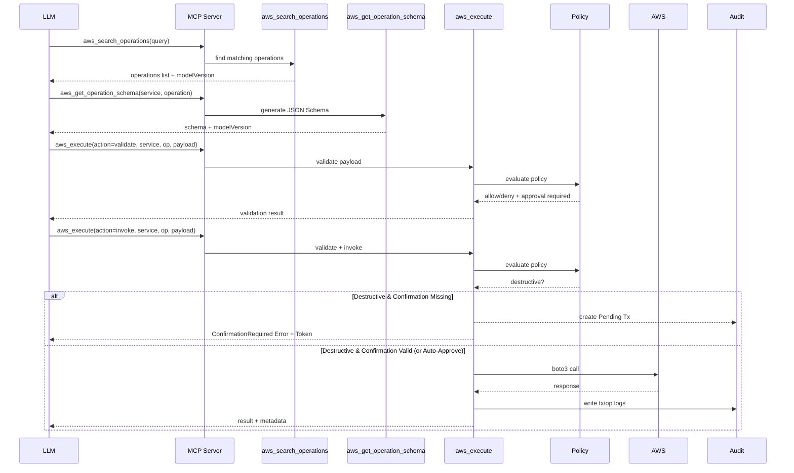
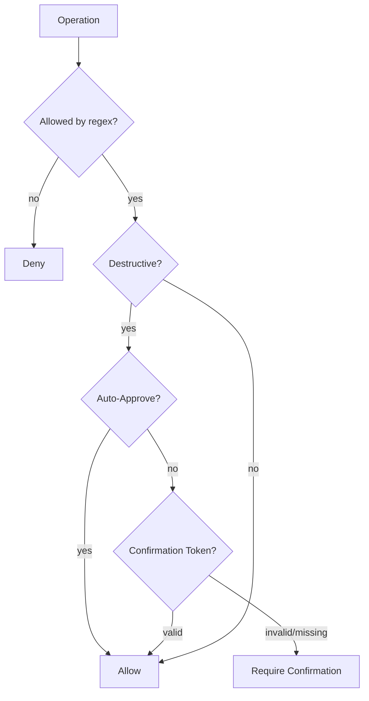
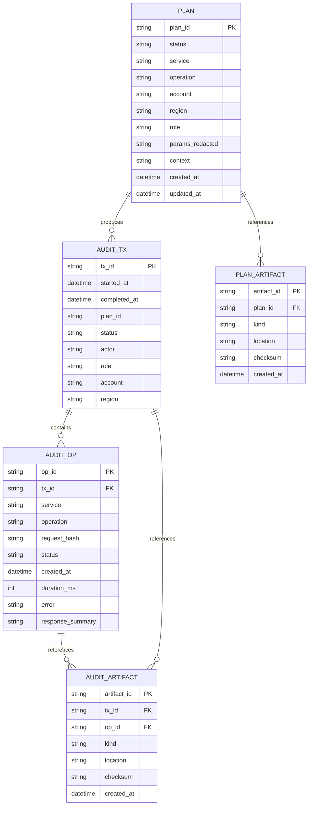
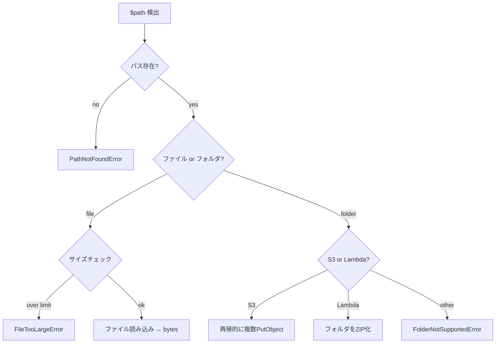

Meta
- Project Title: AWS Tool-Execution MCP Server
- Version: 2.0 (3-tool architecture)
- Last Updated: 2026-01-29

Overview
Purpose & Goals
- Provide a safe, policy-governed MCP server for validating and executing AWS API calls via 3 unified tools.
- Enforce validate-then-invoke workflow with mandatory schema validation before AWS execution.
- Support Smithy-driven tool schemas from AWS-published models with full-service coverage.
- Model versioning via commit SHA pinning for reproducible schemas.
- Standardize idempotency injection, retries, and persistent audit logging with tx_id/op_id.

Architecture
File Tree
- (Current)
  - src/aws_cli_mcp/
    - __init__.py
    - app.py
    - server.py
    - config.py
    - logging_utils.py
    - mcp_runtime.py
    - tools/
      - __init__.py
      - aws_unified.py     # 3 unified tools
      - base.py
    - planning/
      - __init__.py
      - planner.py
      - approval.py
      - state.py
    - execution/
      - __init__.py
      - executor.py
      - idempotency.py
      - aws_client.py
    - policy/
      - __init__.py
      - engine.py
      - models.py
      - loader.py
    - smithy/
      - __init__.py
      - sync.py
      - loader.py
      - parser.py
      - schema_generator.py
      - catalog.py
      - registry.py
      - version_manager.py  # NEW: Model version management
    - audit/
      - __init__.py
      - db.py
      - models.py
      - artifacts.py
    - domain/
      - __init__.py
      - plan.py
      - operations.py
      - approval.py
    - utils/
      - __init__.py
      - jsonschema.py
      - hashing.py
      - time.py
  - policy.yaml
  - docs/
  - tests/

Tech Stack (Latest Stable Versions)
- Python 3.11
- MCP SDK: use official MCP Python SDK if present; otherwise a minimal MCP-compatible server adapter
- boto3 >= 1.34 (AWS SDK)
- pydantic >= 2.6
- SQLite (builtin)
- pytest, ruff (dev)

Pattern
- Clean Architecture with explicit domain models and adapters (MCP layer vs AWS execution).
- 3-Tool Architecture: All AWS operations accessible via unified tools rather than per-operation tools.

Diagrams
- Unified Tool Flow (3-tool architecture)


- Policy evaluation


Data
Schema & ER Diagram
- Schema mirrors authoritative requirements (audit logs, plans, artifacts).


Components
Key Classes, APIs, Interfaces

## MCP Tools (3 Unified Tools)

### aws_search_operations
Search AWS operations from Smithy models.

Input:
```json
{
  "query": "lambda invoke",
  "serviceHint": "lambda",
  "limit": 20,
  "modelVersion": "abc123..."
}
```

Output:
```json
{
  "modelVersion": "abc123...",
  "count": 5,
  "results": [
    {"service": "lambda", "operation": "Invoke", "summary": "Invokes a Lambda function", "risk": "low"}
  ]
}
```

### aws_get_operation_schema
Get JSON Schema for an AWS operation.

Input:
```json
{
  "service": "lambda",
  "operation": "Invoke",
  "modelVersion": "abc123..."
}
```

Output:
```json
{
  "modelVersion": "abc123...",
  "service": "lambda",
  "operation": "Invoke",
  "schema": {...},
  "description": "Invokes a Lambda function"
}
```

### aws_execute
Validate and invoke AWS operations.

Input:
```json
{
  "action": "validate|invoke",
  "service": "lambda",
  "operation": "Invoke",
  "payload": {"FunctionName": "my-function"},
  "region": "us-east-1",
  "modelVersion": "abc123...",
  "options": {
    "dryRun": false,
    "confirmationToken": "..."
  }
}
```

Success Output:
```json
{
  "modelVersion": "abc123...",
  "service": "lambda",
  "operation": "Invoke",
  "result": {...},
  "metadata": {"tx_id": "...", "op_id": "..."}
}
```

Confirmation Required Output:
```json
{
  "modelVersion": "abc123...",
  "error": {
    "type": "ConfirmationRequired",
    "message": "Destructive operation requires confirmation.",
    "hint": "...",
    "reasons": ["Token: A1B2C3", "Target: ..."],
    "retryable": true
  }
}
```

Validation Error Output:
```json
{
  "modelVersion": "abc123...",
  "service": "lambda",
  "operation": "Invoke",
  "error": {
    "type": "ValidationError",
    "message": "Payload validation failed",
    "missing": ["FunctionName"],
    "invalid": [...],
    "allowedValues": {...},
    "hint": "FunctionName is required. Use aws.getOperationSchema to see full schema.",
    "retryable": true
  }
}
```

## Core Components
- VersionManager: Manages model versions with LRU caching, provides ModelSnapshot access.
- SmithyCatalog: Indexes and searches operations from Smithy models.
- PolicyEngine: Evaluates allow/deny rules, destructive actions, tag constraints.
- SmithyLoader/Parser: Loads and parses Smithy models from AWS repository.
- SmithySync: Clones/pulls AWS api-models-aws repository, tracks commit SHA.
- SchemaGenerator: Converts Smithy input shapes to JSON Schema.
- Executor: Executes AWS calls with idempotency injection and audit logging.
- AuditStore: SQLite access layer for tx/op logs.
- ArtifactStore: File-based payload storage with DB references.

Strategies
Performance
- Cache parsed Smithy models and generated schemas in-memory with LRU eviction.
- Model version pinning via commit SHA for reproducible schemas.
- Index audit tables on tx_id, op_id, plan_id, and request_hash.
- Avoid O(n^2) ops by using dict/set for operation lookups.
- 3-tool architecture eliminates tool explosion (no per-operation tools).
- Service toggles: enforce per-service enable/disable from policy at tool exposure and execution time.
- Policy source of truth: service allowlist lives in policy.yaml.
- Smithy source: use AWS GitHub repository aws/api-models-aws for full service coverage.
- Token Cleanup: Lazy cleanup on execution. PendingConfirmation tokens > 1 hour old are deleted during `aws.execute` calls.

Testing
- pytest with unit tests for policy engine, validation, and execution.
- Goal: >= 80% coverage on policy/tools/audit layers.

Environment
- Env vars (keys only):
  - AWS_REGION
  - AWS_PROFILE
  - AWS_ACCESS_KEY_ID
  - AWS_SECRET_ACCESS_KEY
  - AWS_SESSION_TOKEN
  - MCP_HOST
  - MCP_PORT
  - LOG_LEVEL
  - SQLITE_PATH
  - POLICY_PATH
  - ARTIFACT_PATH
  - SMITHY_MODEL_PATH
  - SMITHY_SYNC_URL
  - SMITHY_CACHE_PATH
  - SMITHY_SYNC_REF
  - SMITHY_DEFAULT_MODEL_VERSION
  - SMITHY_MODEL_CACHE_SIZE
  - MCP_REQUIRE_APPROVAL
  - AWS_MCP_AUTO_APPROVE_DESTRUCTIVE

Migration from v1 (Plan/Diff/Apply)
- The Plan/Diff/Apply workflow has been deprecated in favor of the validate→invoke pattern.
- Use `aws.execute(action="validate")` instead of `aws.plan`.
- Use `aws.execute(action="invoke")` instead of `aws.apply`.
- Destructive operations require confirmation via `options.confirmationToken` (unless auto-approve is on).
- The `aws.diff` tool is no longer needed (validation errors are returned directly).

## Local File Upload Support ($path)

blob型フィールドでローカルファイル/フォルダを直接指定可能。

### 使用方法
```json
// base64の代わりにローカルパスを指定
{"Body": {"$path": "/path/to/file.png"}}

// S3フォルダアップロード（複数PutObjectを自動実行）
{"Body": {"$path": "/path/to/folder", "keyPrefix": "uploads/"}}
```

### サービス別制限

| サービス | 操作 | フィールド | サイズ制限 | フォルダ対応 |
|---------|------|-----------|-----------|-------------|
| S3 | PutObject | Body | 5GB | ◯ 複数ファイル |
| Lambda | CreateFunction | ZipFile | 50MB | ◯ 自動ZIP化 |
| Rekognition | DetectLabels等 | Image.Bytes | 5MB | × |
| Textract | AnalyzeDocument | Document.Bytes | 5MB | × |
| Kinesis | PutRecord | Data | 1MB/10MB | × |
| KMS | Encrypt | Plaintext | 4KB | × |
| Secrets Manager | PutSecretValue | SecretBinary | 64KB | × |

### 処理フロー


### スキーマへのヒント追加
aws_get_operation_schemaでblob型に自動追記:
```json
{
  "Body": {
    "type": "string",
    "format": "byte",
    "description": "...(original)... | LOCAL FILE: Use {\"$path\": \"/path/to/file\"} to upload from local filesystem."
  }
}
```

Open Items / TBD
- None. Design updated to 3-tool architecture as of 2026-01-30.
