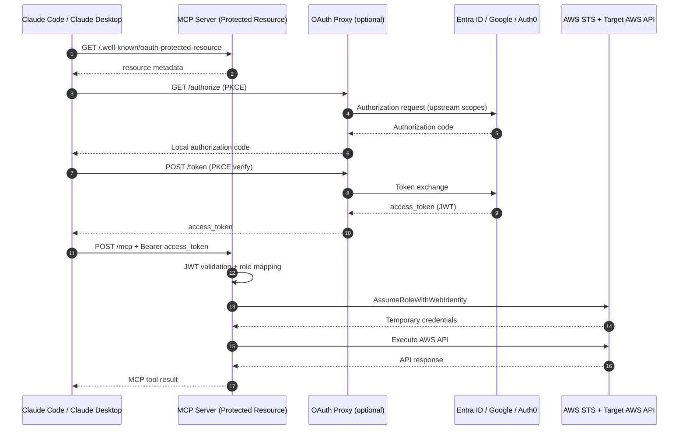
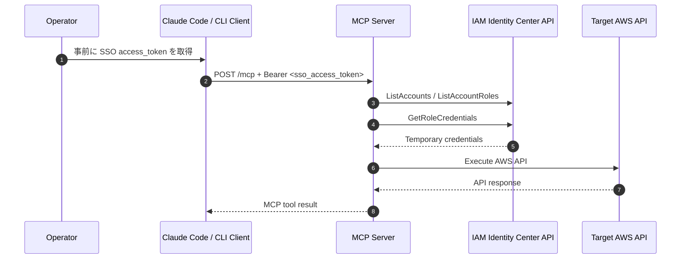
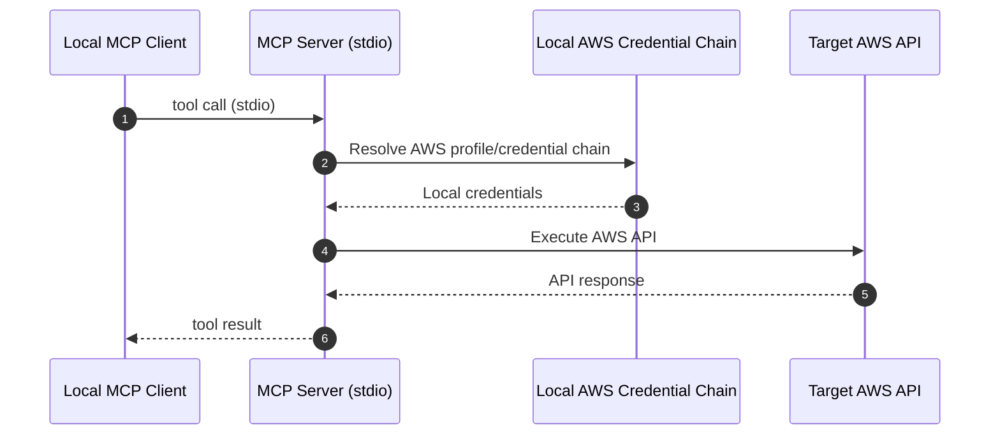

# AWS Tool-Execution MCP Server

このドキュメントは、本プロジェクトの **仕様書 + 手順書** です。  
バージョン履歴・変更履歴は `HISTORY.md` を参照してください（README では管理しません）。

---

## 1. このサーバーがやること

この MCP サーバーは、**Claude Code / Claude Desktop / Gemini CLI**などのアプリケーションから、AWS API を安全に実行するためのツール実行基盤です。

### 1.1 提供価値（何ができるか）

- MCP ツールとして AWS API 実行機能を提供する
- 公開ツールを `aws_search_operations` / `aws_get_operation_schema` / `aws_execute` の 3 つに統一し、運用対象を明確化する
- `aws_execute` を「検証 → 実行」の 2 段階で動かし、型不整合や必須漏れを事前に防ぐ
- HTTP/Remote モードでは Bearer トークンを検証し、ユーザー文脈で AWS 一時資格情報を払い出す
- サーバーは恒久的な AWS secret や Bearer トークンを永続保存しない（メモリ利用 + 期限付き）

### 1.2 HTTP モードの実行原則

- MCP サーバー自身の IAM ロールで固定実行する設計ではなく、ユーザーに紐づく認証情報から AWS の一時資格情報を作る
- これにより 1 つの MCP サーバーで、ユーザーごとに異なる AWS アカウント・権限セットを扱える
- 実装上の経路は次の 2 系統
  - `AUTH_PROVIDER=multi-idp`: OAuth/OIDC access token を検証し、`AssumeRoleWithWebIdentity` で一時資格情報を取得
  - `AUTH_PROVIDER=identity-center`: IAM Identity Center の access token で `sso:GetRoleCredentials` を取得

### 1.3 設計理念（Smithy First）

このプロジェクトは、AWS が提供する Smithy 形式の API モデルを中核に据えて MCP ツール定義を構成します。  
AWS 公式がドキュメント化している「Smithy モデルを MCP のターゲットとして扱う」考え方に沿い、**モデル駆動で安全に API 実行する**ことを目的としています。

Smithy とは、API をモデル（設計図）として定義するための IDL（Interface Definition Language）とツール群です。  
入力・出力、必須項目、型、制約、エラーを機械可読に表現でき、モデルを起点にコード生成・検証・ドキュメント生成へ接続できます。

Smithy モデルは主に `Shape`（型）と `Trait`（メタ情報）で構成されます。  
`structure` で入出力形状を定義し、`@required` のような trait で必須性を明示します。

```smithy
$version: "2"
namespace example.weather

@readonly
operation GetForecast {
  input: GetForecastInput
  output: GetForecastOutput
}

structure GetForecastInput {
  @required
  city: String
}

structure GetForecastOutput {
  temperatureC: Integer
}
```

### 1.4 MCP と Smithy の関係

- Smithy モデルを使うことで、MCP ツールの入力/出力スキーマを厳密化できる
- LLM 実行時の「必須漏れ」「型違い」「フィールド名違い」を低減できる
- CLI バージョン差やシェル依存の揺れを避け、API オペレーション中心で扱える

### 1.5 Smithy 採用メリット

- 引数・必須/任意・型・制約をモデルで固定でき、誤実行を抑えられる
- MCP ツール定義の自動生成/検証を行いやすい
- AWS 側モデル更新への追従性が高い（モデル更新差分を追跡しやすい）
- モデル/ターゲット単位で許可操作を絞りやすく、最小権限運用に寄せやすい
- 差分検証・互換性チェック・回帰テストがしやすい
- コード生成/モック生成に接続しやすく、検証環境を作りやすい

---

## 2. 動作モード

### 2.1 `stdio` モード
- ローカル MCP として起動
- ローカルの AWS 資格情報（`AWS_PROFILE` など）を利用

### 2.2 `http` モード
- HTTP サーバーとして起動
- `Authorization: Bearer <token>` 必須
- トークン検証後、ユーザー文脈に紐づく AWS 一時資格情報を解決
- MCP サーバー共通ロールではなく、マッピングされたロール/権限で API 実行

### 2.3 `remote` モード
- `http` と同等だが、Streamable HTTP 用の厳格チェックを有効化
- Claude Code / Claude Desktop でのリモート接続向け

---

## 3. 認証方式の選択

### 3.1 推奨: `AUTH_PROVIDER=multi-idp`

このプロジェクトの主対象（Claude Code / Claude Desktop）では、こちらを推奨します。

- `/.well-known/oauth-protected-resource` を公開
- 必要に応じて OAuth proxy モードを有効化し、以下を公開
  - `GET /authorize`
  - `POST /token`
  - `POST /register`
  - `GET /oauth/callback`
  - `GET /.well-known/oauth-authorization-server`
  - `GET /.well-known/openid-configuration`

### OAuth proxy モードのポイント
- クライアントから来た `resource` パラメータは upstream(IdP)にそのまま転送しない
- proxy→IdP 間は PKCE (`S256`) を利用（authorization_code では PKCE 必須）
- upstream トークン交換の認証方式は `upstream_token_auth_method` で制御
  - `none`: public client（secret 送信しない）
  - `client_secret_post`: confidential client（secret 送信）
  - `auto`: secret 有無で自動判定
- `/authorize` は redirect URI を検証し、不正形式を拒否する
- 未登録 client の redirect URI は localhost loopback のみに制限する（open redirect 抑止）
- `/token` は `client_id` / `redirect_uri` を必須にし、発行済み code レコードと厳密一致で検証する
- upstream token 交換エラー時、クライアントにはサニタイズ済みエラーのみ返却する（詳細はサーバーログ）

### 3.2 代替: `AUTH_PROVIDER=identity-center`

- IAM Identity Center の access token を直接受けて `sso:GetRoleCredentials` を使う方式
- Entra OAuth と同じ `/mcp auth` の発見・認可フローは提供しない
- Bearer トークンを事前取得して渡す運用が前提

---

## 4. 1リクエストの内部処理（HTTP/Remote）

1. クライアントが `/mcp` に JSON-RPC を POST
2. PreAuth セキュリティ（IP レート制限、ヘッダ/ボディサイズ、タイムアウト）
3. JWT 検証（issuer/audience/exp/署名）
4. ロールマッピング（claims → role ARN）
5. STS `AssumeRoleWithWebIdentity` で一時資格情報を取得
6. `aws_execute` が policy + schema をチェックして AWS API を実行
7. 監査ログ（tx/op/artifact）を保存

補足:
- `/mcp` は POST 専用です。`GET /mcp` は 405 が正しい挙動です。
- JSON-RPC 通知（`id` なし）には 202 を返します。
- Bearer token / AWS 一時資格情報はログへマスクし、永続保存しない運用です。

### 4.1 認証フロー図（HTTP/Remote: OAuth + STS Web Identity）



注記:
- `oauth_proxy.enabled=false` の場合、`/authorize` `/token` はプロキシを経由せず、クライアントが IdP と直接やり取りします。

### 4.2 認証フロー図（HTTP: IAM Identity Center token）



注記:
- この方式は `/mcp auth` の自動認可導線ではなく、事前取得した token を Bearer として渡す運用です。

### 4.3 実行フロー図（stdio ローカル）



### 4.4 本番ネットワーク推奨（ALB/Nginx/API Gateway）

HTTP モードは、MCP サーバー前段に ALB / Nginx / API Gateway などを配置し、TLS 終端を行う構成を強く推奨します。  
ローカル開発では `http://localhost` で検証可能ですが、本番公開では HTTPS 前提で運用してください。

推奨理由:

- Bearer token は漏えいすると不正 API 実行に直結するため、経路暗号化が必須
- 中間者攻撃や盗聴でトークン/ペイロードが取得されるリスクを下げる
- Forwarded ヘッダとアクセス制御（IP 制限、WAF、レート制限）を前段で統合できる
- 証明書管理や自動更新をアプリ本体から分離できる

---

## 5. セットアップ手順（推奨構成: Entra + OAuth proxy + AWS OIDC）

### 5.1 前提

- Python 3.11+
- `pip install -e .`
- `cp .env.example .env`
- `AUTH_PROVIDER=multi-idp`
- `AUTH_IDP_CONFIG_PATH=./idp_config.yaml`

### 5.2 Entra 側の設定

最低 2 つの登録を推奨します。

1. API アプリ（resource 側）
- `Expose an API` で OAuth scope 例: `aws.execute`（これはツール名ではなく scope）
- Application ID URI 例: `api://<RESOURCE_APP_ID>`
- `accessTokenAcceptedVersion = 2`（重要）

2. クライアント（OAuth 実行主体）
- Redirect URI に `http://localhost:8000/oauth/callback` を追加（ローカル検証時）
- public client か confidential client かを決定
  - public client: secret なし
  - confidential client: secret あり

### 5.3 `idp_config.yaml` 設定

まずは `idp_config.example.yaml` から作成してください。

```bash
cp idp_config.example.yaml idp_config.yaml
```

### 最低限合わせる値

- `idps[0].issuer`:
  - `https://login.microsoftonline.com/<TENANT_ID>/v2.0`
  - token の `iss` と **完全一致** が必要
- `idps[0].audience`:
  - token の `aud` / `azp` 実値に合わせる
- `protected_resource.resource`:
  - ローカルは `"auto"` を推奨
- `oauth_proxy.enabled`:
  - `true`（Entra 互換用）
- `oauth_proxy.upstream_token_auth_method`:
  - public client なら `none`
  - confidential client なら `client_secret_post`
- `oauth_proxy.upstream_scopes`:
  - まず `openid profile offline_access`
  - API scope を使う場合は `api://<RESOURCE_APP_ID>/aws.execute`
- `security`:
  - `idp_config.yaml` は `${AUTH_*}` 参照にし、実値は `.env`（`AUTH_RATE_LIMIT_PER_USER` など）で一元管理する

### 5.4 AWS 側の設定（最重要）

### A. IAM OIDC Provider
- Provider URL は token の `iss` と一致
  - 例: `https://login.microsoftonline.com/<TENANT_ID>/v2.0`
- Audience (`client_id_list`) は token の `aud` / `azp` と一致
  - 例: `api://<RESOURCE_APP_ID>`

### B. AssumeRoleWithWebIdentity 用 IAM ロール
- **専用ロール**を作成し、Trust Policy に以下を設定
- `AWSReservedSSO_*` ロールをそのまま使うのは非推奨

Trust Policy 例（概念例）:

```json
{
  "Version": "2012-10-17",
  "Statement": [
    {
      "Effect": "Allow",
      "Principal": {
        "Federated": "arn:aws:iam::<ACCOUNT_ID>:oidc-provider/login.microsoftonline.com/<TENANT_ID>/v2.0"
      },
      "Action": "sts:AssumeRoleWithWebIdentity",
      "Condition": {
        "StringEquals": {
          "login.microsoftonline.com/<TENANT_ID>/v2.0:aud": "api://<RESOURCE_APP_ID>"
        }
      }
    }
  ]
}
```

### 重要：`sub` ではなく `oid` と `tid` による制限（Entra 推奨）

**注意**: Entra ID の `sub` は pairwise（クライアントごとに異なる値）になることがあり、アプリが変わると値が変わるため運用が不安定になりがちです。
より安定した制限を行うには、不変のオブジェクトID (`oid`) とテナントID (`tid`) を使用します。

```json
      "Condition": {
        "StringEquals": {
          "login.microsoftonline.com/<TENANT_ID>/v2.0:aud": "api://<RESOURCE_APP_ID>",
          "login.microsoftonline.com/<TENANT_ID>/v2.0:oid": "<USER_OBJECT_ID>",
          "login.microsoftonline.com/<TENANT_ID>/v2.0:tid": "<TENANT_ID>"
        }
      }
```

### Pro Tip: App Role による制限（運用が最も楽）

個別のユーザーIDをポリシーに書く代わりに、Entra 側で App Role（例: `AwsCliMcp.Admin`）を作成し、そのロールを持つユーザーのみを許可する方式が管理しやすく推奨されます。
`roles` クレームは配列で渡されるため、`ForAnyValue:StringEquals` を使用します。

```json
      "Condition": {
        "StringEquals": {
          "login.microsoftonline.com/<TENANT_ID>/v2.0:aud": "api://<RESOURCE_APP_ID>",
          "login.microsoftonline.com/<TENANT_ID>/v2.0:tid": "<TENANT_ID>"
        },
        "ForAnyValue:StringEquals": {
          "login.microsoftonline.com/<TENANT_ID>/v2.0:roles": "AwsCliMcp.Admin"
        }
      }
```

### なぜ二重に制限するのか？（Defense in Depth）

この構成は、**MCPサーバー（`role_mappings`）とAWS（IAM Trust Policy）の双方で二重にブロックすること**を意図しています。

1.  **MCPサーバー側**: 正常な運用時に、ユーザーを適切なロールに振り分ける（ルーティング）。
2.  **AWS側**: ロールを引き受けられるユーザーを厳密に指定し、不正な引き受けを拒否する（ガードレール）。

もし MCP サーバーの設定ファイル（`idp_config.yaml`）が悪意を持って書き換えられ、一般ユーザーが管理者ロールにマッピングされたとしても、AWS 側の Trust Policy で許可されたユーザー（または App Role）でなければ `AssumeRole` は失敗します。
これにより、**「設定ファイルの改ざんによる権限昇格」や「意図しないマッピングミスによる過剰権限の付与」を AWS 側で確実に防ぐことができます。**

### C. `role_mappings` を専用ロール ARN に更新
- `idp_config.yaml` の `role_mappings[].role_arn` を専用ロールへ変更

### 5.5 起動

```bash
TRANSPORT_MODE=http python server.py
```

### 5.6 Claude Code / Claude Desktop から接続

- `https://<host>/mcp`（ローカルなら `http://localhost:8000/mcp`）を指定
- 必要に応じて `/mcp auth` 実行

---

## 6. 設定項目リファレンス（.env）

主要項目のみ抜粋。詳細は `.env.example` を参照してください。

| 変数 | 必須 | 意味 | 代表値 | 入手元 / 備考 |
|---|---|---|---|---|
| `TRANSPORT_MODE` | Yes | 起動モード | `stdio` | `stdio` (ローカル), `http` (Docker/Server), `remote` (Claude Desktop) |
| `AUTH_PROVIDER` | HTTP/RemoteでYes | 認証方式 | `multi-idp` | AWS SSOのみなら `identity-center`, Entraなど外部IdPなら `multi-idp` |
| `AUTH_IDP_CONFIG_PATH` | multi-idpでYes | IdP定義ファイル | `./idp_config.yaml` | リポジトリ内のファイルを指定 |
| `AUTH_IDENTITY_CENTER_REGION` | identity-centerでYes | IAM Identity Center リージョン | `ap-northeast-1` | AWSコンソール > IAM Identity Center > 設定 |
| `MCP_HOST` | No | bind host | `0.0.0.0` | コンテナなら `0.0.0.0`, ローカルのみなら `127.0.0.1` |
| `MCP_PORT` | No | bind port | `8000` | 任意の空きポート |
| `AWS_STS_REGION` | HTTP/Remoteで推奨 | STS呼び出しリージョン | `us-east-1` | 基本的に `us-east-1` (グローバルエンドポイント) または利用リージョン |
| `POLICY_PATH` | 推奨 | ローカルポリシー | `./policy.yaml` | 許可する操作を定義したファイルパス |
| `SQLITE_PATH` | 推奨 | 監査DB | `./data/aws_mcp.sqlite` | 監査ログの保存先 |
| `ARTIFACT_PATH` | 推奨 | 監査artifact保存先 | `./data/artifacts` | ログファイルの保存先 |
| `MCP_INSTRUCTIONS` | No | カスタム指示 | (Default) | AIへの振る舞い指示を上書きする場合に指定 |
| `MCP_REQUIRE_APPROVAL` | No | 全承認必須化 | `false` | `true` にすると全てのツール実行で承認を要求 |
| `AWS_MCP_AUTO_APPROVE_DESTRUCTIVE` | No | 破壊的操作の承認スキップ | `false` | `true` にすると削除系操作の二段階認証をスキップ (非推奨) |
| `AUTH_ALLOW_MULTI_USER` | No | 複数principal同時利用の許可 | `false` | 既定は single-user モード（最初の認証principalのみ許可） |
| `HTTP_ALLOWED_ORIGINS` | No | CORS 許可 Origin | (空) | カンマ区切りで指定。Remoteモード用 |
| `HTTP_ENABLE_CORS` | No | CORS 有効化 | `false` | ブラウザから直接接続する場合に `true` |
| `HTTP_TRUST_FORWARDED_HEADERS` | No | `X-Forwarded-*` 信頼 | `false` | trusted proxy 配下でのみ `true` 推奨 |
| `LOG_FILE` | No | ログファイル出力 | (なし) | 指定したパスにログを出力 |
| `LOG_LEVEL` | No | ログレベル | `INFO` | `DEBUG`, `INFO`, `WARNING`, `ERROR` |
| `AWS_REGION` | No | AWSリージョン | `us-east-1` | `AWS_DEFAULT_REGION` でも可。SDKデフォルト |
| `AWS_PROFILE` | No | AWSプロファイル | `default` | `~/.aws/credentials` のプロファイル名 (stdio用) |

### AIへの振る舞い指示 (MCP_INSTRUCTIONS)

`MCP_INSTRUCTIONS` は、Claude などの AI モデルに対して「この MCP サーバーをどう使うべきか」を指示するシステムプロンプトです。

- **デフォルト値**:
  > "Use these tools to plan, diff, and apply AWS operations. Always request approval for destructive actions."
  > （計画・差分確認・適用という手順を踏むこと、破壊的操作は必ず承認を求めること）

- **活用例**:
  - **回答言語の指定**: `MCP_INSTRUCTIONS='Always answer in Japanese. ...'`
  - **運用ルールの徹底**: `MCP_INSTRUCTIONS='Read-only operations are allowed, but write operations must be double-checked.'`
  - **特定の前提条件**: `MCP_INSTRUCTIONS='Assume the environment is strictly production. Be extremely cautious.'`

### Smithy Model 設定（高度な利用時のみ）

通常はデフォルト（自動同期は無効）で問題ありません。

| 変数 | 意味 | デフォルト値 | 備考 |
|---|---|---|---|
| `SMITHY_AUTO_SYNC` | 起動時にAWS公式モデルをgit syncするか | `false` | 必要時のみ `true` 推奨 |
| `SMITHY_SYNC_URL` | 同期元 git リポジトリ | `https://github.com/aws/api-models-aws.git` | |
| `SMITHY_SYNC_REF` | 同期対象の git ref | `main` | 特定バージョン固定時に指定 |
| `SMITHY_MODEL_PATH` | モデルファイルの読込先ディレクトリ | `./data/smithy_cache/models` | |
| `SMITHY_CACHE_PATH` | git clone 先ディレクトリ | `./data/smithy_cache` | |
| `SMITHY_MODEL_CACHE_SIZE` | メモリにキャッシュするモデルバージョン数 | `3` | |

注記:
- 実行可否の制限は `policy.yaml` を唯一のソースとして扱います。Smithy 側の追加 allowlist 設定は廃止されています。

### Entra 用 env（`idp_config.yaml` 内で参照）

`idp_config.yaml` の `${VAR}` で展開される変数です。

| 変数 | 意味 | Azure Portal 取得場所 |
|---|---|---|
| `ENTRA_TENANT_ID` | Entra tenant ID | Entra ID > 概要 > **テナント ID** |
| `ENTRA_CLIENT_ID` | API アプリまたは検証対象 audience | App Registrations > [対象アプリ] > 概要 > **アプリケーション (クライアント) ID** |
| `ENTRA_PROXY_CLIENT_ID` | OAuth proxy 用 client ID | App Registrations > [Proxy用アプリ] > 概要 > **アプリケーション (クライアント) ID** |
| `ENTRA_PROXY_CLIENT_SECRET` | confidential client 用 secret | App Registrations > [Proxy用アプリ] > 証明書とシークレット > **クライアント シークレット** |

---

## 7. 設定項目リファレンス（idp_config.yaml）

### 7.1 `idps[]`

| 項目 | 必須 | 意味 | 設定値の取得元・注意点 |
|---|---|---|---|
| `name` | Yes | IdP識別名 | 任意（ログ出力に使われます。例: `entra`） |
| `issuer` | Yes | 許可する `iss` | Entraの場合: `https://login.microsoftonline.com/<TENANT_ID>/v2.0`<br>※**必ず実際のトークンの `iss` クレームと完全一致させてください** |
| `audience` | Yes | 許可する `aud`/`azp` | Entraの場合: `api://<CLIENT_ID>` または `<CLIENT_ID>`<br>※App Registration > API の公開 > **アプリケーション ID の URI** |
| `allowed_algorithms` | No | 許可署名アルゴリズム | Entraは通常 `RS256` |
| `claims_mapping` | No | claim 名対応 | Entraは `user_id: oid` (不変ID), `email: email` が基本 |

### 7.2 `protected_resource`

| 項目 | 必須 | 意味 | 設定のヒント |
|---|---|---|---|
| `resource` | Yes | 保護対象リソース識別子 | ローカル開発は `"auto"` 推奨。<br>本番は `https://api.example.com/mcp` 等の絶対URI |
| `scopes_supported` | Yes | クライアントに提示する scope | 最低限 `openid`, `profile`, `offline_access` を指定 |
| `bearer_methods_supported` | No | Bearer の受け取り方法 | 通常 `header` (Authorizationヘッダ) |
| `resource_documentation` | No | 説明ドキュメント URL | 任意 |

### 7.3 `oauth_proxy`

| 項目 | 必須 | 意味 | 設定のヒント |
|---|---|---|---|
| `enabled` | Yes | proxy モード有効化 | Entra ID 連携時は `true` 推奨 |
| `upstream_idp` | 推奨 | 上流IdP名 | `idps[].name` と一致させる (例: `entra`) |
| `upstream_client_id` | enabled時Yes | upstream 用 client ID | `${ENTRA_PROXY_CLIENT_ID}` (Proxy用アプリID) |
| `upstream_client_secret` | 条件付き | confidential client 時に必要 | `${ENTRA_PROXY_CLIENT_SECRET}` |
| `upstream_token_auth_method` | No | 認証方式 | publicなら`none`, confidentialなら`client_secret_post` |
| `upstream_scopes` | Yes | upstream authorize scope | `api://<RESOURCE_APP_ID>/<SCOPE>` を含める |
| `redirect_path` | No | upstream callback | デフォルト `/oauth/callback` でOK (IdP設定と一致させる) |

### 7.4 `role_mappings[]`

IdPのユーザー情報（Claim）に基づいて、AWSの実行権限（AccountID + IAM Role）を決定します。
上から順に評価され、**最初に一致したルールが適用されます（First-match-wins）**。

| 項目 | 必須 | 意味 | 設定のヒント |
|---|---|---|---|
| `email_domain` | 条件付 | メールドメイン一致 | 社員全員に同じ権限を付与する場合などに利用 |
| `user_id` | 条件付 | ユーザーID完全一致 | 特定個人のみに強い権限を付与する場合に利用<br>※Entraの場合は `oid` (Object ID) を推奨 |
| `groups` | 条件付 | グループ所属有無 | IdP側でグループ管理する場合に利用<br>※ `groups` claim がトークンに含まれている必要あり |
| `claims` | 条件付 | 任意claimの一致 | `department: engineering` などカスタム属性での制御 |
| `account_id` | Yes | AWS アカウントID | `123456789012` (文字列) |
| `role_arn` | Yes | AWS IAM Role ARN | `arn:aws:iam::...` (このロールに `AssumeRoleWithWebIdentity` します) |

**設定例:**

```yaml
role_mappings:
  # 1. 特定のユーザーID（管理者）
  # Entra の場合、user_id には oid (Object ID) を指定することを推奨
  - user_id: "aaaaaaaa-bbbb-cccc-dddd-eeeeeeeeeeee"
    account_id: "123456789012"
    role_arn: "arn:aws:iam::123456789012:role/MCP-Admin-Role"

  # 2. Tech グループ所属者（開発者）
  # トークンの "groups" claim に "group-uuid-..." が含まれていればマッチ
  - groups: ["group-uuid-for-tech-team"]
    account_id: "123456789012"
    role_arn: "arn:aws:iam::123456789012:role/MCP-Developer-Role"

  # 3. 特定ドメインのメールアドレス（読み取り専用）
  # 上記にマッチしなかった @example.com のユーザー
  - email_domain: "example.com"
    account_id: "123456789012"
    role_arn: "arn:aws:iam::123456789012:role/MCP-ReadOnly-Role"
```

---

## 8. 提供ツール仕様

### 8.1 `aws_search_operations`
- 目的: 操作候補を検索
- 入力: `query`, `serviceHint`, `limit`
- 出力: service/operation/summary/risk

### 8.2 `aws_get_operation_schema`
- 目的: 対象操作の JSON Schema 取得
- 入力: `service`, `operation`
- 出力: 厳密な入力スキーマ

### 8.3 `aws_execute`
- 目的: 検証または実行
- 入力: `action=validate|invoke`, `service`, `operation`, `payload`, `options`
- 破壊的操作は確認トークン方式

---

## 9. ログの見方（今回の実運用で出る代表パターン）

### 正常時に見えるログ
- `GET /.well-known/oauth-protected-resource/mcp` -> 200
- `GET /.well-known/oauth-authorization-server` -> 200
- `GET /authorize ...` -> 302
- `GET /oauth/callback ...` -> 302
- `POST /token` -> 200
- `POST /mcp` -> 200

### 正常時でも出ることがあるログ
- `GET /.well-known/oauth-authorization-server/mcp` -> 401
- `GET /.well-known/openid-configuration/mcp` -> 401
- `GET /mcp/.well-known/openid-configuration` -> 401
- `GET /mcp` -> 405
- `POST /mcp` -> 202（通知メッセージ）

これらはクライアント側の探索/通知によるもので、最終的に 200 系が継続していれば問題ありません。

---

## 10. 代表的な認証エラーと対処（時系列履歴は `HISTORY.md` を参照）

運用時に遭遇しやすい問題と対処の要約です。

| 事象 | 原因 | 対処 |
|---|---|---|
| Entra `Incompatible auth server: does not support dynamic client registration` | Entra が DCR 非対応 | 事前登録（client/app scope）方式へ変更 |
| `AADSTS9010010 invalid_target` | `resource` と scope 対象 URI 不一致 | `resource/scope` 戦略を統一。proxy で upstream へ resource 非転送 |
| `AADSTS500011 invalid_resource (api:/...)` | API URI 記述ミス | `api://<APP_ID>/<scope>` に修正 |
| `AADSTS700025 invalid_client` | public client に secret を送信 | `upstream_token_auth_method=none` を導入 |
| `unknown_issuer` (`sts.windows.net`) | v1 token と v2 issuer 不一致 | Entra API app を `accessTokenAcceptedVersion=2` へ変更 |
| STS `Unknown parameter: Tags` | WebIdentity API が `Tags` 非対応 | 実装から Tags 送信を削除 |
| STS `No OpenIDConnect provider found` | AWS 側 OIDC provider 未作成/不一致 | issuer 一致で OIDC provider 作成 |
| STS `AccessDenied sts:AssumeRoleWithWebIdentity` | 対象ロールの trust policy 不備（または不適切なロール） | 専用 IAM ロール作成 + trust policy 更新 + role_mappings 反映 |

---

## 11. トラブルシュート・チェックリスト

1. token の `iss` / `aud` / `azp` 実値を確認したか
2. `idp_config.yaml` の `issuer` / `audience` が実値と一致しているか
3. AWS IAM OIDC Provider の URL が `iss` と完全一致しているか
4. AWS IAM OIDC Provider の audience が `aud`/`azp` に一致しているか
5. `role_mappings` が WebIdentity 対応ロール ARN を指しているか
6. trust policy に `sts:AssumeRoleWithWebIdentity` があるか
7. `oauth_proxy.upstream_token_auth_method` が client 種別と一致しているか
8. `protected_resource.resource` は `auto` か正しい URL か

---

## 12. 開発者向け

### テスト

```bash
PYTHONPATH=src pytest tests/
```

### Lint

```bash
ruff check src/ tests/
```

---

## 13. 参考

- 設計詳細: `DESIGN.md`
- 履歴管理: `HISTORY.md`
- 設定テンプレート: `.env.example`, `idp_config.example.yaml`
