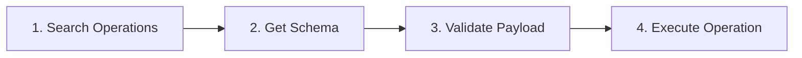

# AWS Tool-Execution MCP Server

Model Context Protocol (MCP) server that exposes safe, policy-governed AWS operations to LLM clients using a unified 3-tool architecture.

All executions are audited with `tx_id`/`op_id` and are gated by **Dual Permission** (IAM + Policy) and (when required) human approval.

## 🚀 Getting Started

### 1. Install Dependencies
```bash
python -m venv .venv
source .venv/bin/activate
pip install -U pip
pip install -e .
# Optional: pip install -e .[runtime] (for FastMCP)
```

### 2. Configure Credentials
Copy `.env.example` to `.env` and set your AWS keys/region.
Ensure your AWS CLI environment is authenticated (`aws sts get-caller-identity`).

### 3. Run Server
```bash
python -m aws_cli_mcp.server
```

---

## 🛠 Core Workflow (3-Tool Architecture)

This server simplifies AWS interaction into **3 unified tools**.
Recommended flow for agents:



### Step 1: `aws.searchOperations`
Find the correct operation and service name from Smithy models.
*Example:* "I need to list simple storage buckets" -> Finds `s3:ListBuckets`.

### Step 2: `aws.getOperationSchema`
Get the exact JSON Schema for params.
*Example:* Returns valid inputs for `s3:ListBuckets`.

### Step 3: `aws.execute` (action="validate")
Check against schema and policy *before* touching AWS.
*Example:* "Is `BucketName` correct? Am I allowed to run this?"

### Step 4: `aws.execute` (action="invoke")
Execute the actual AWS API call.
*Example:* Actually lists the buckets.

---

## 🔒 Security & Architecture

### Dual Permission Management (Defense in Depth)
An operation is allowed **ONLY IF** it passes **BOTH** checks:
1.  **AWS IAM Layer**: The underlying AWS credentials must have permission.
2.  **MCP Policy Layer** (`policy.yaml`): The server's internal allowlist must permit it.

> [!IMPORTANT]
> **Deny Precedence**: If `policy.yaml` has a DENY rule (e.g., `Delete*`), it **overrides** any IAM permissions. Even if the underlying IAM user is `AdministratorAccess`, the MCP server will refuse to execute banned commands.

### Operational Protection
- **Destructive Confirmation**: Operations like `TerminateInstances` trigger a strict confirmation flow. The server returns a **Confirmation Token** (valid for 1 hour) which must be presented to proceed.
- **Lazy Cleanup**: Expired tokens are automatically purged from the system.

---

## 📦 Smithy Model Integration

The server derives its capabilities *dynamically* from AWS [Smithy Models](https://github.com/aws/api-models-aws).

### Auto-Sync & Daily Updates
By default (`SMITHY_AUTO_SYNC=true`), the server clones the official AWS repository on startup.
- **Benefit**: You automatically support new AWS services and API updates without code changes.
- **Requirement**: Execution methods and schemas change daily. **Always** use `getOperationSchema` to verify the latest parameters rather than hardcoding payloads.

### Version Pinning
For stable production environments, you can pin a specific commit SHA via `.env`:
```bash
SMITHY_DEFAULT_MODEL_VERSION=commit_sha_here
SMITHY_AUTO_SYNC=false
```
This ensures your agent sees a frozen view of the AWS API.

---

## ⚙️ Configuration

### Environment Variables (.env)
- `SMITHY_SYNC_URL`: Upstream repo URL.
- `SMITHY_MODEL_PATH`: Local cache path.
- `AWS_MCP_AUTO_APPROVE_DESTRUCTIVE`: Bypass confirmation (Use with caution!).
- `LOG_LEVEL`: `INFO` or `DEBUG`.

### Policy Configuration (policy.yaml)
Controls the **MCP Policy Layer**.
```yaml
services:
  allowlist:
    - s3
    - lambda
  denylist:
    - iam # Explicitly block sensitive services
rules:
  deny:
    - "^Delete.*" # Global ban on deletion
```

---

## 📚 Tool Reference

### 1. `aws.searchOperations`
**Input**: `{"query": "lambda list", "serviceHint": "lambda"}`
**Output**: List of operations with descriptions and risk levels.

### 2. `aws.getOperationSchema`
**Input**: `{"service": "lambda", "operation": "Invoke"}`
**Output**: JSON Schema of the input payload.

### 3. `aws.execute`
**Input**:
```json
{
  "action": "invoke",
  "service": "lambda",
  "operation": "Invoke",
  "payload": { "FunctionName": "my-func" },
  "options": { "confirmationToken": "..." }
}
```

---

## 📋 Appendix: Supported Services

This list is dynamically generated from the Smithy models.
(Add to `services.allowlist` in `policy.yaml` to enable).

<details>
<summary>Click to view all 300+ supported AWS Services</summary>

- accessanalyzer
- account
- acm
- acm-pca
- aiops
- amp
- amplify
- amplifybackend
- amplifyuibuilder
- apigateway
- appconfig
- appconfigdata
- appfabric
- appflow
- application-autoscaling
- application-signals
- appmesh
- apprunner
- appsync
- arc-region-switch
- arc-zonal-shift
- artifact
- athena
- auditmanager
- autoscaling
- autoscaling-plans
- b2bi
- backup
- backup-gateway
- batch
- bcm-dashboards
- bcm-data-exports
- bcm-recommended-actions
- bedrock
- bedrock-agent
- bedrock-agent-runtime
- bedrock-agentcore
- bedrock-agentcore-control
- bedrock-data-automation
- bedrock-data-automation-runtime
- bedrock-runtime
- billing
- billingconductor
- braket
- budgets
- ce
- chatbot
- chime
- cleanrooms
- cleanroomsml
- cloud9
- clouddirectory
- cloudformation
- cloudfront
- cloudfront-keyvaluestore
- cloudhsm
- cloudhsmv2
- cloudsearch
- cloudsearchdomain
- cloudtrail
- cloudtrail-data
- codeartifact
- codebuild
- codecatalyst
- codecommit
- codeconnections
- codedeploy
- codeguru-reviewer
- codepipeline
- codestar-connections
- codestar-notifications
- cognito-identity
- cognito-idp
- cognito-sync
- comprehend
- comprehendmedical
- compute-optimizer
- config
- connect
- connectcampaigns
- connectcampaignsv2
- controlcatalog
- controltower
- cost-optimization-hub
- cur
- databrew
- dataexchange
- datapipeline
- datasync
- datazone
- dax
- deadline
- devicefarm
- devops-guru
- directconnect
- discovery
- dlm
- dms
- drs
- ds
- ds-data
- dsql
- dynamodb
- ebs
- ec2
- ec2-instance-connect
- ecs
- eks
- eks-auth
- elasticache
- elasticbeanstalk
- emr-containers
- entityresolution
- es
- events
- evidently
- evs
- finspace
- firehose
- fis
- fms
- forecast
- forecastquery
- frauddetector
- freetier
- fsx
- gamelift
- gameliftstreams
- glacier
- globalaccelerator
- glue
- grafana
- greengrass
- groundstation
- guardduty
- health
- healthlake
- iam
- identitystore
- imagebuilder
- inspector
- inspector2
- internetmonitor
- invoicing
- iot
- iotanalytics
- iotevents
- iotfleetwise
- iotsitewise
- iotthingsgraph
- iottwinmaker
- ivs
- ivschat
- kafka
- kafkaconnect
- kendra
- kendra-ranking
- kinesis
- kinesisanalytics
- kinesisvideo
- kms
- lakeformation
- lambda
- license-manager
- lightsail
- location
- logs
- lookoutequipment
- m2
- machinelearning
- macie2
- managedblockchain
- marketplacecommerceanalytics
- mediaconnect
- mediaconvert
- medialive
- mediapackage
- mediapackage-vod
- mediapackagev2
- mediastore
- medical-imaging
- mgh
- mgn
- migrationhub-config
- mpa
- mq
- mwaa
- neptunedata
- network-firewall
- networkflowmonitor
- networkmanager
- networkmonitor
- notifications
- nova-act
- oam
- observabilityadmin
- odb
- omics
- opensearchserverless
- organizations
- osis
- outposts
- panorama
- partnercentral-account
- partnercentral-benefits
- partnercentral-channel
- partnercentral-selling
- pcs
- personalize
- personalize-events
- personalize-runtime
- pi
- pinpoint
- pipes
- polly
- proton
- qbusiness
- qconnect
- quicksight
- ram
- rbin
- rds
- redshift
- rekognition
- repostspace
- resiliencehub
- resource-explorer-2
- resource-groups
- rolesanywhere
- route53
- route53-recovery-cluster
- route53-recovery-control-config
- route53-recovery-readiness
- route53domains
- route53globalresolver
- route53profiles
- route53resolver
- rtbfabric
- rum
- runtime.sagemaker
- s3
- s3tables
- s3vectors
- savingsplans
- scheduler
- schemas
- secretsmanager
- securityhub
- securitylake
- serverlessrepo
- servicecatalog
- servicecatalog-appregistry
- servicediscovery
- shield
- signer
- signin
- simspaceweaver
- sms-voice
- snowball
- sns
- sqs
- ssm
- ssm-contacts
- ssm-sap
- sso
- storagegateway
- sts
- support
- swf
- synthetics
- taxsettings
- textract
- tnb
- transcribe
- transfer
- translate
- trustedadvisor
- verifiedpermissions
- waf
- waf-regional
- wafv2
- wellarchitected
- wisdom
- workdocs
- workmail
- workmailmessageflow
- workspaces
- workspaces-web
- xray

</details>
